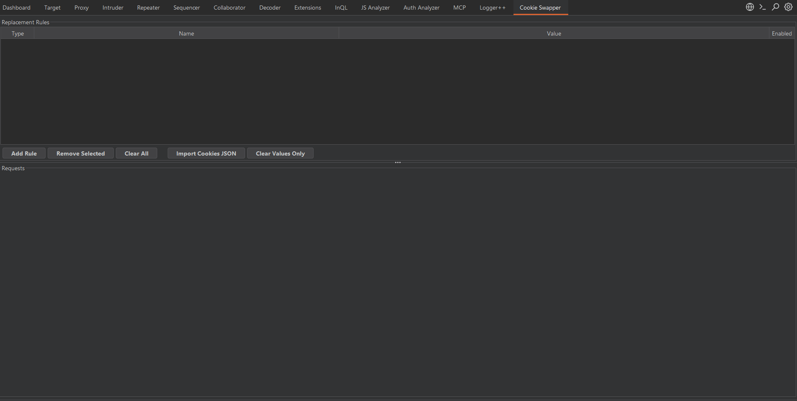

# Cookie Swapper

Burp Suite extension that auto-replaces cookies and headers in requests. Stop wasting time copy-pasting session tokens into every request.



## Why?

You got a retest, a needs more info bug, or just expired sessions. You need to replay dozens of requests from HTTP History and Repeater but your session expired. Now you gotta replace cookies in every single request manually. That's annoying and wastes time.

Cookie Swapper fixes that. Define your replacement rules once, and every request you send through the plugin gets updated cookies/headers automatically.

## Features

- **Hotkey** — `Ctrl+Shift+Q` sends the selected request with fresh tokens (no right-click needed)
- **Right-click menu** — Send to Cookie Swapper from anywhere in Burp
- **Replacement rules** — Cookie and header replacement with enable/disable toggle
- **JSON import** — One-click import from [Cookie Editor](https://cookie-editor.com/) browser extension
- **Status color coding** — Green (2xx), blue (3xx), orange (4xx), red (5xx) tab colors
- **Status filters** — Filter tabs by status code to quickly find failing requests
- **Custom tab bar** — Wrapping tabs with middle-click to close, Close All button, All Tabs dropdown
- **Keyboard shortcuts** — `Ctrl+W` close tab, `Ctrl+]` next tab, `Ctrl+[` previous tab
- **Send / Send (No Replace)** — Resend with or without applying rules
- **Persistent rules** — Rule names and types saved to Burp project (values cleared on restart for security)
- **Delete key** — Select a rule and press Delete to remove it

## Install

1. Grab `CookieSwapper.jar` from [Releases](../../releases)
2. Burp → Extensions → Add → Java → select the jar

## How to use

1. Open the **Cookie Swapper** tab in Burp
2. Add rules — set type (Cookie or Header), name, and value
3. Or click **Import Cookies JSON** to import from clipboard
4. Go to Proxy History / Site Map / anywhere and select a request
5. Press `Ctrl+Shift+Q` or right-click → **Send to Cookie Swapper**
6. Request opens in a new tab with cookies replaced and response shown
7. Use the **status filter buttons** (All, 2xx, 3xx, 4xx, 5xx) to filter tabs
8. Click **Send** to resend with current rules, or **Send (No Replace)** to send as-is

## Build

```
./gradlew jar
```

Output: `build/libs/CookieSwapper-1.0.0.jar`

## License

MIT
